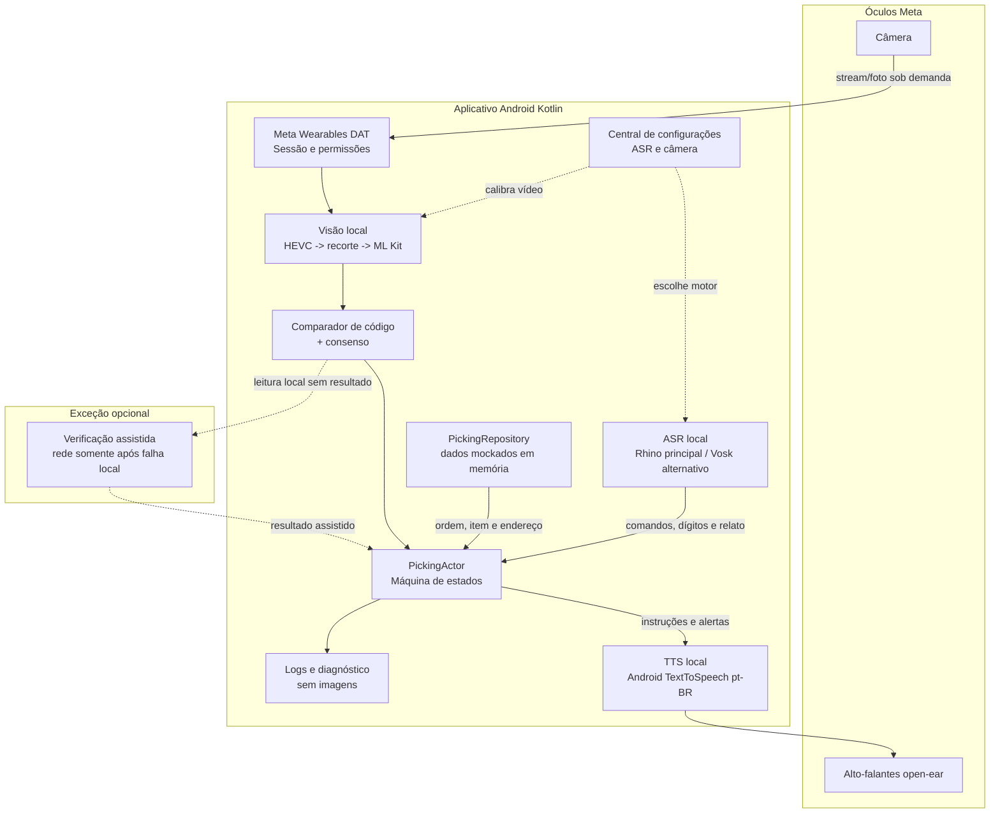

# Seção B — Diagrama de arquitetura

## Arquivo de imagem para upload

Use [agv-pick-voice-arquitetura.svg](agv-pick-voice-arquitetura.svg) como a imagem do diagrama. O arquivo é vetorial e pode ser enviado diretamente onde o Ideathon aceitar SVG.

## Código-fonte Mermaid

## Leitura do diagrama

- Os óculos fornecem câmera e reprodução de áudio; o smartphone hospeda o aplicativo e o processamento.
- A máquina de estados é o ponto único que aceita eventos e decide transições.
- A central de configurações, persistida para a bancada, escolhe o motor ASR e calibra qualidade, FPS, rotação e captura por foto. Alterações são aplicadas após reiniciar o app.
- Ordem e dados de referência vêm de memória no protótipo; não há integração WMS nesta entrega.
- A verificação assistida é opcional e só acontece depois de falha no caminho local.
